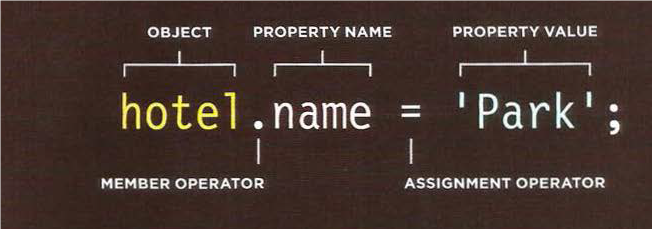

# Object-Oriented Programming, HTML Tables

## Domain Modeling

Domain modeling is a way of modeling our code into a more conception way as we describe different attributes and behaviours of entities. Therefore, It is a means to communicate between the technical team and other major teams like business team. 

defining any constructor needs we need to make a constructor function that contains properties and if we need we can use it for the method and that will help us to use it when we make-instance of an object using the constructor using these steps:

1. using the new keyword creates an object.

2. use this to initialize properties inside the object.

3. and that's how the object will be stored in a variable for late use.


## Table
In any business, mainly tables are regarded as one of the essentials, such as when any company wants to collect information about the company's financial status, it needs tables to display the numbers and can be read more easily by anyone. therefore, tables are used to read information more easily and that's why it's used in the structure of any website or as we called HTML.

### Basic Table Structure

every table has two main structures and these are columns and rows and in HTML these two is expressed using two tags and one essential tage andd these are:
* first table tag that is always used in the beginning of any table.
```
               <table>
```
* secondly to indicate the start of each row :
```
                 <tr>
```
* and finally to indicate the start of each column:
```
                 <td>
```
### Extra tags in table
with extra other tags that can beused to add more structure to   any table like headings and stretching for the table:

* Table headings:

```
             <th>
```
* Spanning Columns
* Spanning Rows
* Long Tables


## Object

There different method to build an object and one of them is using the constructor that could be more useful than any method before because it could help us to make the program easily build and with less complication.


### Creating A Constructor

To create an object using costructor notation we need the:

1. new keyword 

2. object constructor

3. with the proerties and method that is given to the object.

### Updating The Object

there are two methods to update any object:

**1.dot notation :**



**2.square brackets**


to create many object we can use function as a template for the constructor and use it whenever we want.

### array and objects

we can say an array is regarded as an object as it can store multiple data like an object therefore practice with it as an object. Also, we can combine it with other objects to create a complex data structure in our code.

### built-in objects

There are three groups of built-in objects:

**1. Browser Object Model**

**2. Document Object Model**

**3. Global JavaScript Objects**


 
